## Cloud Service Providers Foundation Project
### Stage Zero Guide 
*End2End set-up from GitHub to Debugging in Eclipse Enterprise Developer*           

Date Created: 16th May 2022

Last updated: 31st May 2022

Created by: Paul Jennings & Russell Bonner

***

# About
Stage Zero ensures that a basic end to end understanding is obtained prior to focussing on cloud scenarios. The end-to-end steps includes cloning a Git repository, compiling the code, creating a new CICS region and debugging the code. 

# Prerequisites
The following items are required to be in place prior to this guide.

1. GitHub SSH connectivity with Enterprise Developer. [^githubssh]
2. Access to the relevant GitHub repository.
3. A clean Enterprise Developer Workspace.
4. The installation of Rumba, either as a separate product or as part of ED, is required.

[^githubssh]: [GitHub SSH Guide](https://docs.github.com/en/authentication/connecting-to-github-with-ssh)

# Primary Objectives
The following objectives can be considered as the Definition of Done (DoD):-

1. Source code has been successfully cloned from GitHub.
2. Source code has been successfully compiled.
3. A new region has been successfully created.
4. Source code has been successfully debugged in Enterprise Developer.

# Secondary objectives
The following secondary objectives are optional.

1. Make a source code change and successfully push and commit the code base back to GitHub.
2. Study the .gitignore file and understand how it works.
3. Set the TN3270 port to be static.
4. Use an external Rumba TN3270 instance.
5.	Use “Post-build Events” rather than specifying the target binary output directory.
6.	Use CICS Group BANKGRP2 instead of BANKGRP, and study the CATALOG configuration.


# The Guide
The following steps are required to be completed in order.

## Step 1 - Clone
***

NB: When starting Enterprise Developer, set the automatic project build setting to off (to stop automatic build before the project is ready)

1) From GitHub, [1] find the repository your wish to use, [2] click the green code button and [3] copy the SSH URL path.

	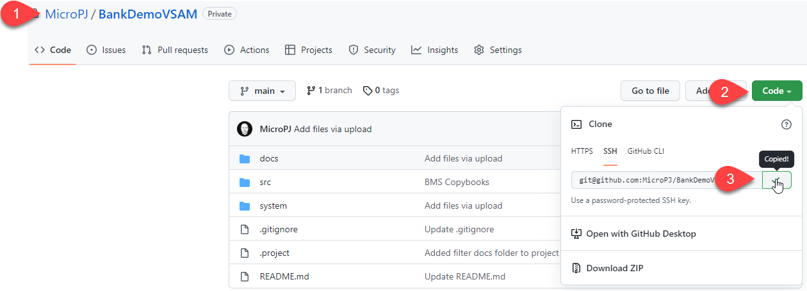

2) Within Enterprise Developer, [1] select the git perspective and then [2] Clone a Git repository

	
	
3) Paste in the copied SSH URL and check it populates the boxes as shown below. Click Next to continue.

	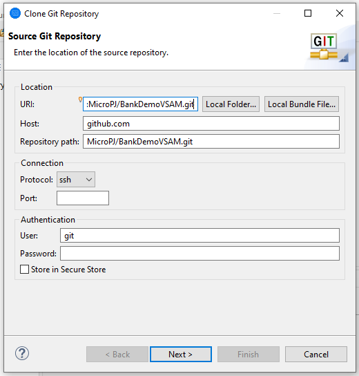

4) [1] Select only the development branch, and [2] click next to continue

	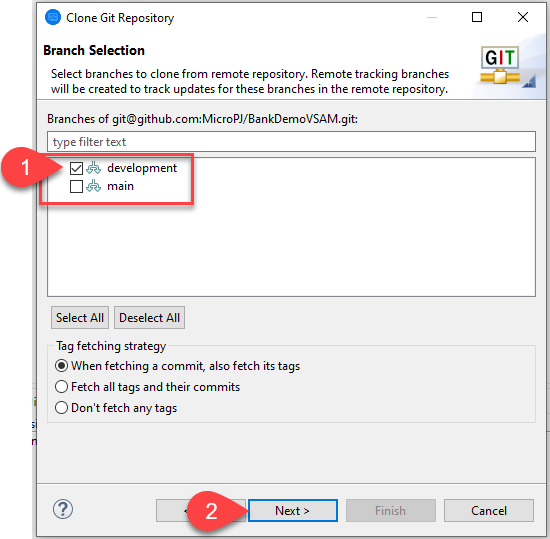

5) [1] Select to import the project files and then [2] Finish

	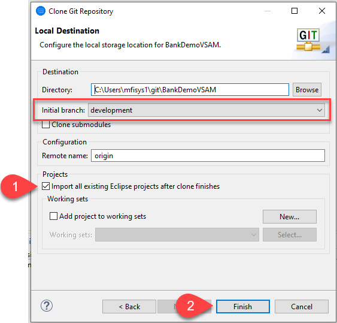

6) Enterprise Developer will now pull the GitHub repository locally and populate a new Project. Once the repository has been pulled, you will see the contents in the left window within the Team Developer view.

## Step 2 - Compile
***
1) [1] Switch to the Team perspective view, and the [2] project will be visible.

	
	
	**Optional**: Right hand mouse click the Team Developer and select "Show Text"
		
	

2) The newly created project will need some basic settings applied to the  Micro Focus Properties. 

	*Open Micro Focus Properties*

	

	*Set Output Path* NB: Ignore any warnings.

	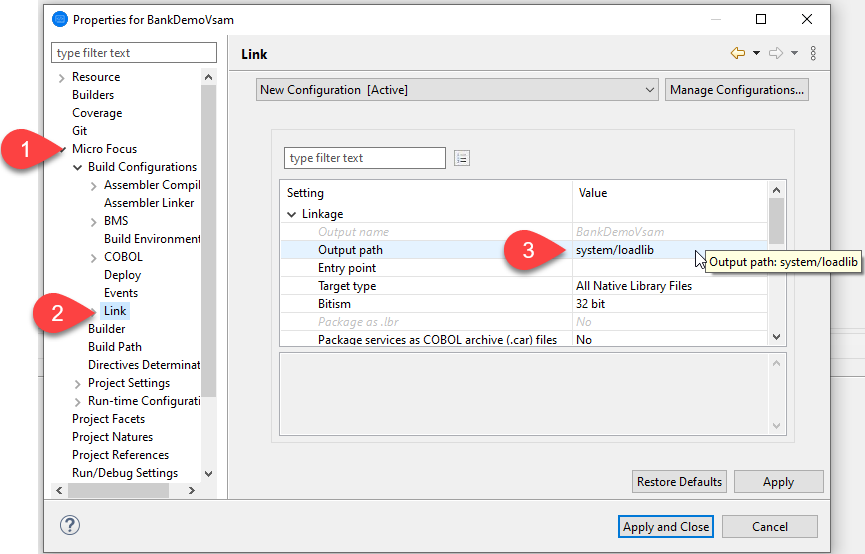

	*Set BMS Maps to CPY (if required)*

	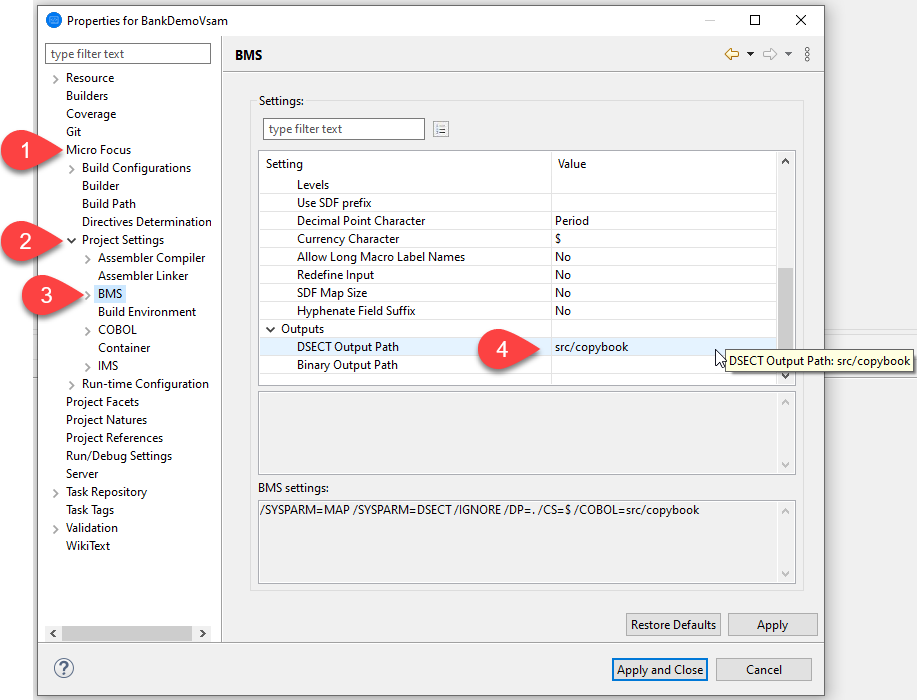

3) [1] Right hand mouse click on the application, and [2] select Determine Directives.

	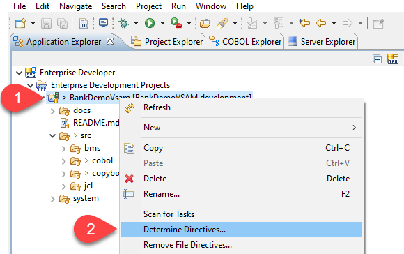
	
	**NB**: Click Okay in the pop-up once the directives have been determined. This may take a few minutes.

4) [1] You can now Build the project.

	

5) [1] Check that the compilation was clean.

	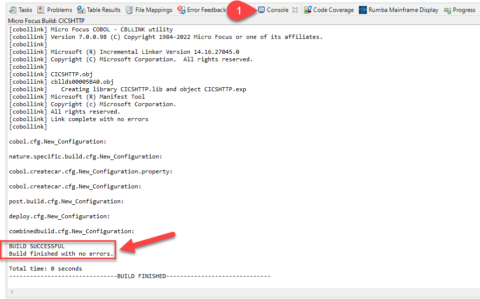

## Step 3 - Create Region
***
1) [1] Select Server Explorer, [2] right hand click on Local, and [3] select Open Administration Page

	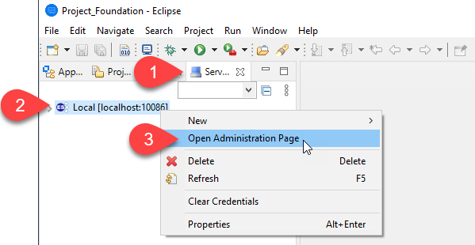

2) [1] Select Default within the Directory Servers section, [2] click New, and [3] save after entering a meaningful 6 character name and longer description

**NB**: Consider setting the TN3270 Listener Port to 5001, so that you have a known TN3270 Port number when debugging BankDemo later in this guide

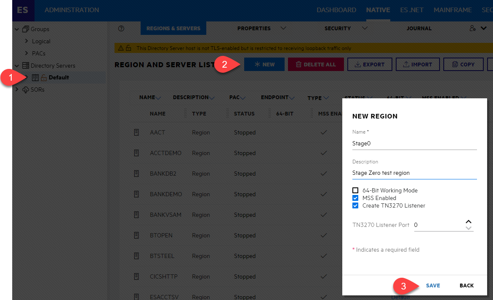

3) [1] Select GENERAL Properties on your new Region, [2] populate the ES-Environment section within the Configuration Information box, [3] input the System Directory, and [4] click to Allow Dynamic Debugging.

	**NB**: Use the COPY BOXES below for example configuration

	

	**Ensure** you click [5] APPLY to save changes
	
	**NB**: Ensure the ESP logical path is updated to reflect your local environment, i.e. {USERNAME}
	
***Config Copy Boxes***

[2] Configuration Information [^ed7config]
		
```
[ES-Environment]
ESP=\Users\{USERNAME}\git\BankDemoVSAM\system
MF_CHARSET=E
```

[3] System Directory
	
```
$ESP\logs
```

[^ed7config]: [Enterprise Developer Configuration](https://www.microfocus.com/documentation/enterprise-developer/ed70/ED-Eclipse/BKCACACONFU004.html)

4) [1] Select CICS, [2] populate the Resource Definition File Path, [3] Transaction Path, [4] File Path, and [5] Map Path

	**NB**: Use the COPY BOXES below for example configuration

	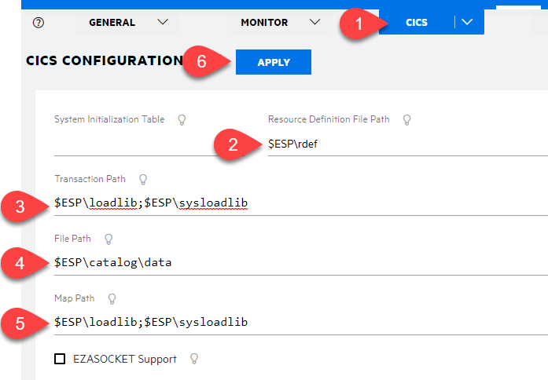

	**Ensure** you click [6] APPLY to save changes

***Config Copy Boxes***
	
[2] Resource Definition File Path

```
$ESP\rdef
```

[3] Transaction Path

```
$ESP\loadlib;$ESP\sysloadlib
```

[4] File Path
	
```
$ESP\catalog\data
```
	
[5] Map Path
	
```
$ESP\loadlib;$ESP\sysloadlib
```

5) [1] Select JES, [2] populate the JES Program Path, [3] Default Allocated Dataset Location, [4] System Catalog, and [5] System Procedure Library

	**NB**: Use the COPY BOXES below for example configuration

	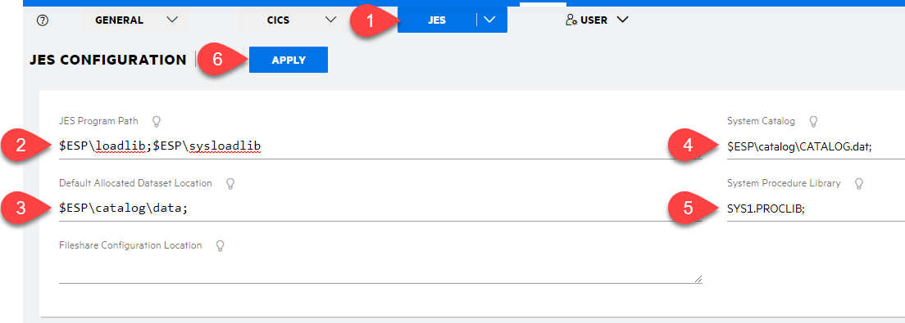

	**Optional** Add a JES Initiator
	
	
	
	**Ensure** you click [6] APPLY to save changes
	
***Config Copy Boxes***
	
[2] JES Program Path
	
```
$ESP\loadlib;$ESP\sysloadlib
```
	
[3] Default Allocated Dataset Location
	
```
$ESP\catalog\data
```

[4] System Catalog
	
```
$ESP\catalog\CATALOG.dat
```
	
[5] System Procedure Library
	
```
SYS1.PROCLIB
```

6) [1] Open an Enterprise Developer Command Prompt **and** change directory to the rdef folder of your project before executing the commands below
[2] Create a vanilla rdef file [^ed7caspcrd] (rdef), and [3] Update the clean vanilla rdef with the project definitions 

	

	**NB**: Ensure the rdef logical path is updated to reflect your local environment
	
[2] Create a vanilla rdef file [^ed7caspcrd]
	
```
caspcrd /c
```
	
[3] Update rdef file with project definitions
	
```
casrdtup /fbankvsam.rdt /opC:\Users\{USERNAME}\git\BankDemoVSAM\system\rdef
```

[^ed7caspcrd]: [Enterprise Developer CICS Commands: caspcrd](https://www.microfocus.com/documentation/enterprise-developer/ed70/ED-Eclipse/HRMTRHCOMM13.html)

7) [1] Start your new region

	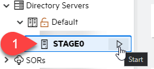

8) [1] Select Monitor, [2] Logs, and [3] Console Log to check the region has strated successfully.

	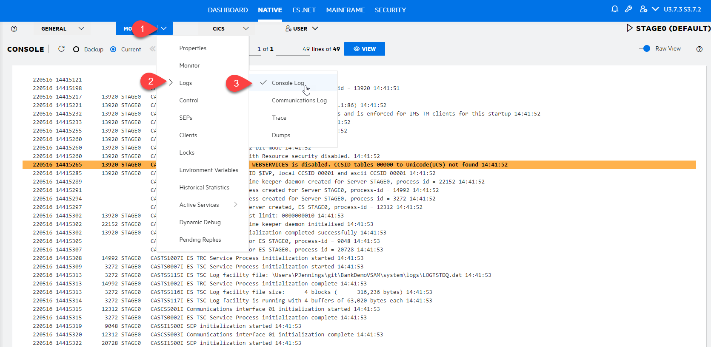

9) [1] Select CICS, [2] Resources, [3] by Group, and BANKGRP to confirm that the rdef Updated worked.

	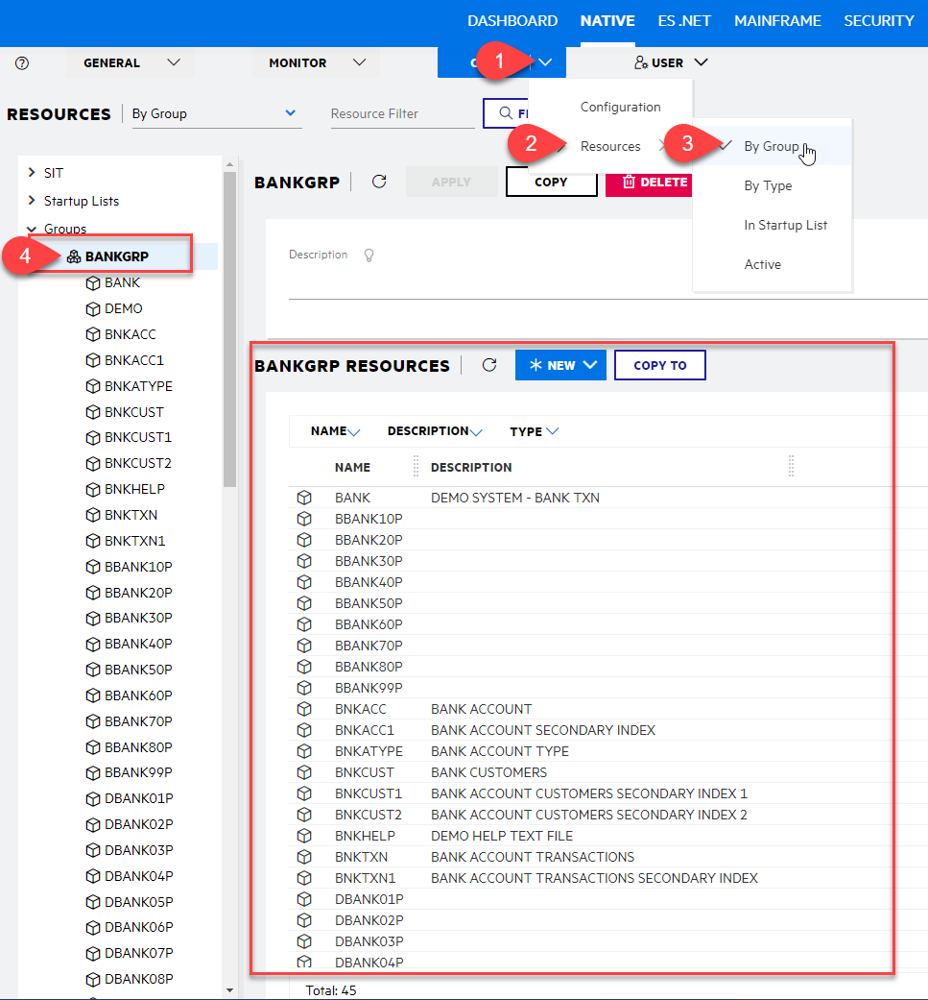

10) [1] Select Startup Lists, [2] MCOSUPL, and [3] COPY to clone an existing Startup List.

	

11) [1] Input a meaningful name, [2] Description, [3] ADD a Group, [4] BANKGRP, and [5] click Select to add.

	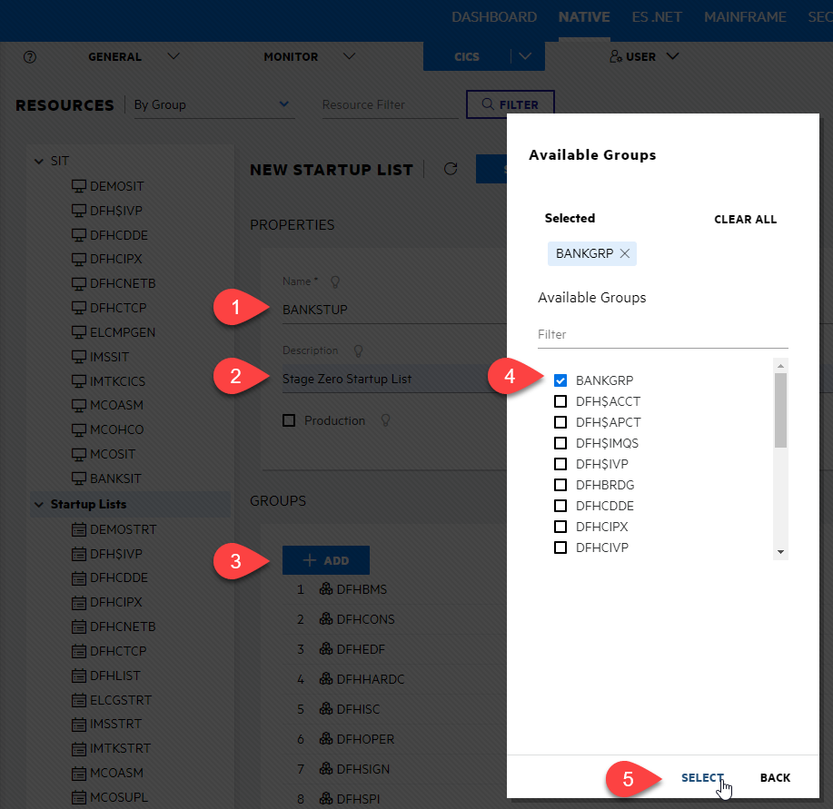
	
**Ensure** you click SAVE to save changes

12) [1] Select SIT, [2] MCOSIT, and [3] COPY to clone an existing SIT.

	

13) [1] Input a meaningful name, [2] Description, [3] Select the new Start Up List created, [4] Change SysID (optional), [5] initial Tran ID (optional), and [6] SAVE.

	**NB**: Untick the Development SIT

	

14) [1] Select CICS, [2] Update the SIT to the newly created one, and [3] APPLY.

	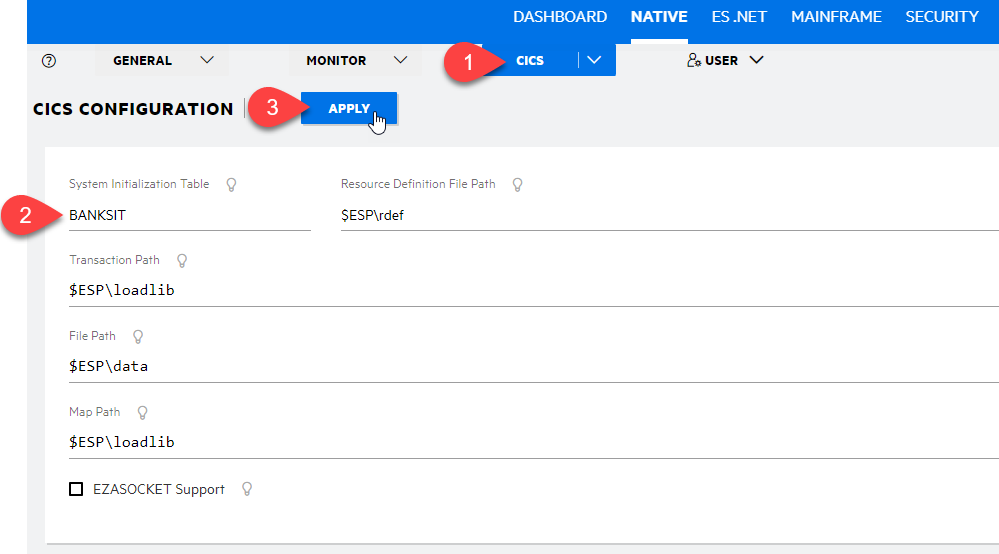

15) Start/Restart the region and check the Console logs

	**Optional** Save the example JCL below to a file and run through JES
	
```
//MFIDEMO  JOB MFIDEMO,MFIDEMO,CLASS=A,MSGCLASS=H,NOTIFY=MFIDEMO        00000100
//STEP01   EXEC PGM=IEFBR14                                             00000200
//SYSPRINT DD SYSOUT=*                                                  00000300
```

*Hint*: look at the JES options

## Step 4 - Debug
***

**Optional**: Before you start to debug, its a good idea to confirm that the BANK transaction is working as expected within Rumba+

1) [1] Select Server Explorer, [2] Right hand click and select, [3] Associate with Project, and [4] Select the project. The region should restart and check the logs double check it started okay.

	
	
2) [1] Select the Application view, [2] Right hand click on the project, [3] select debug as, and [4] CICS on COBOL Enterprise Server.

	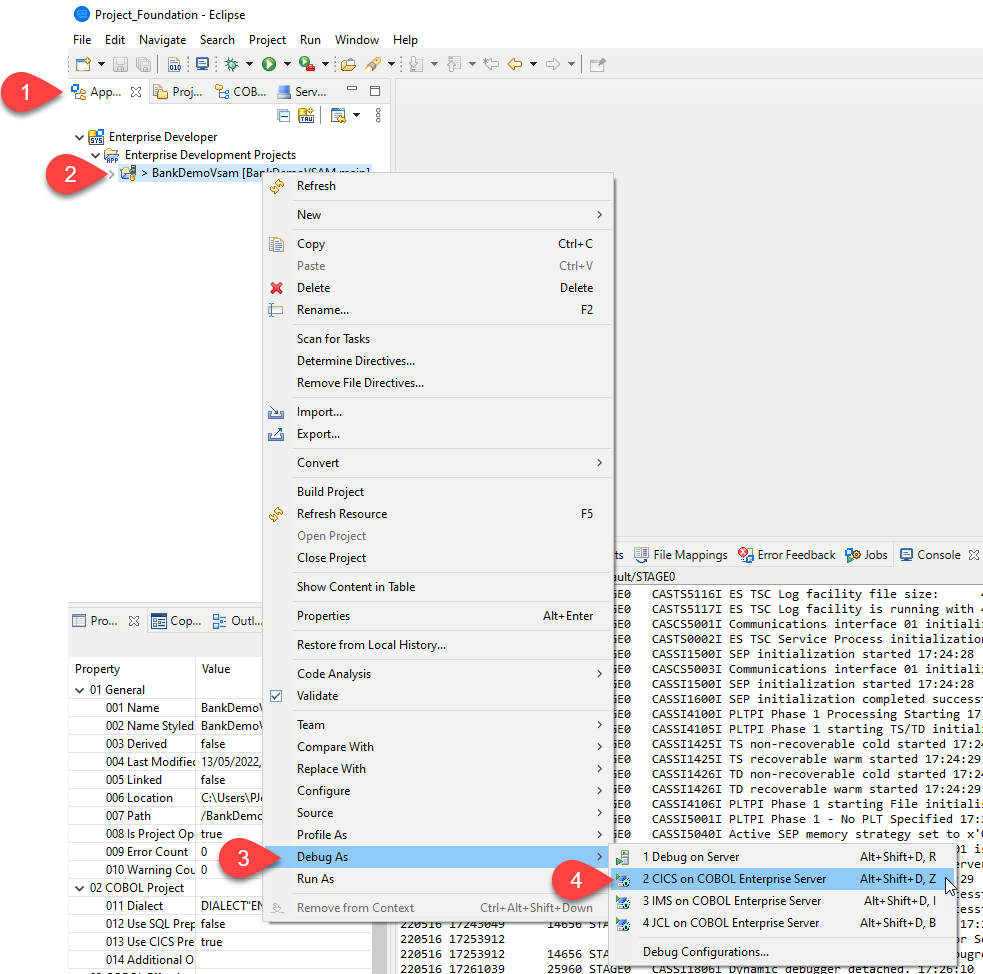
	
3) Depending on your Enterprise Developer environment, you may be prompted to use Rumba to connect to the region. If so, click Connect and continue.
4) [1] In the Rumba window, or externally if you are chosing to use Rumba direct, press CTRL+SHIFT+Z to clear the screen and then type "bank" and press enter.

	
	
5) [1] Debugging with Enterprise Developer is now active and [2] attached. Perform normal debugging processes and [3] stop debugging when finished.

	
	